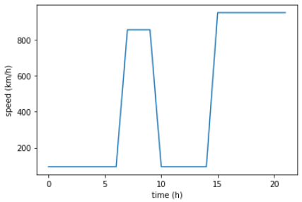
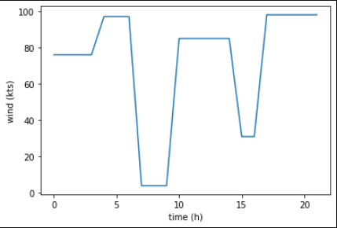
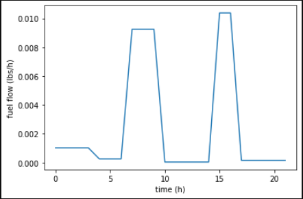
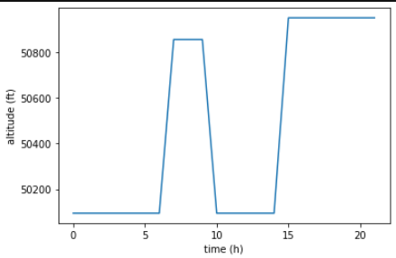

**Safety Line Data Science & Data Engineering technical test**

-   The main goal of this test is to evaluate the capacity of the
    candidate to work in the SITA FOR AIRCRAFT Data Science environment

Requirements:

-   python &gt;= 3.7

-   pandas &gt;= 1.2.4

**Question 1**

*The aim of question 1 is to check if all “Safety Line data scientist
daily tasks” are mastered, from processing raw data to model building.*

Simulated flight signals representing fuel flow (in pound per second),
altitude (in feet), wind (in knots) and speed (in km/h) are stored in
the *question1* folder of the archive in DataFrame format. Each
dataframe stores signals in the following structure:

1.  indexes: time vector

2.  columns: number of flights

Dataframes can be read with pickle reader method, for exemple:

output = pd.read\_pickle("signals\_altitude.pkl")

For example, signals of the flight \#44 are stored in the
44th column.

<table>
<colgroup>
<col style="width: 49%" />
<col style="width: 50%" />
</colgroup>
<thead>
<tr class="header">
<th></th>
<th></th>
</tr>
</thead>
<tbody>
<tr class="odd">
<td></td>
<td></td>
</tr>
</tbody>
</table>

Note that time vector can be different from one flight number to
another.

Write a script or a notebook which contains all the step to answer below
questions.

1.  Explain the data processing steps to select the best features and
    prepare them for the learning phase

2.  Build a fuel flow model as a function of:

    -   effective speed range of data

    -   constant altitude of 8000 ft

    -   why not wind speed?

3.  Build fuel flow model as a function of:

    -   \[0-15000\] ft altitude range

    -   constant speed of 665 km/h

    -   why not wind speed?

4.  Bonus: Build fuel flow model as a function of speed and altitude on
    the effective range of data

**Question 2: packaging**

*The question 2 gives a good overview of python packaging practices in
the data science team, ie package a Python application, create the
equivalent API to use this application with standard protocol and
finally create a docker image for production deployment. Note that this
exercise is doable even without mastering Docker and flask*

-   Question 2.1. The module question2.py aims at building a simple
    machine learning model (classification or regression). Your goal is
    to build a package. Expected result: a tar archive that would be
    installed using pip.

-   Question 2.2. Build a Flask API from the previous package. The
    routes will be:

    -   /: returns a string.

    -   /functions: returns the list of all implemented functions.

    -   /process: generates a dataset, builds a model and returns a json
        containing the statistics, the error rate and the final
        predictions. The parameters n\_samples, n\_features and problem
        will be the inputs.

    -   /classification/process generates a classification dataset,
        builds a model and returns a json containing the statistics, the
        error rate and the final predictions. The parameters n\_samples
        and n\_features will be the inputs.

    -   /regression/process generates a regression dataset, builds a
        model and returns a json containing the statistics, the error
        rate and the final predictions. The parameters n\_samples and
        n\_features will be the inputs.

-   Question 2.3. Build a Docker image from the previous API. Expected
    result: the Dockerfile and other relevant files

-   Question 2.4. Which framework/solution can we use if we want to
    have **many asynchronous accesses** to the API (multithreading and
    multiprocessing) ?
